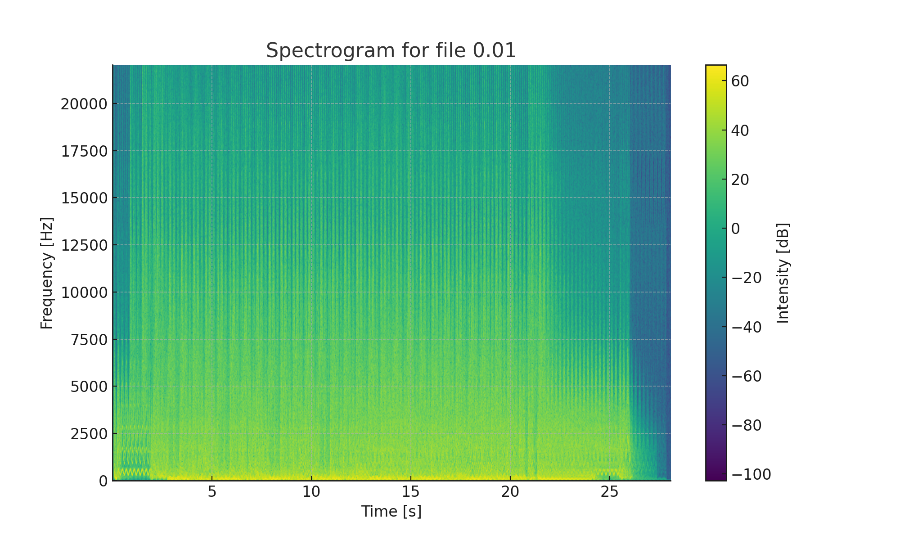
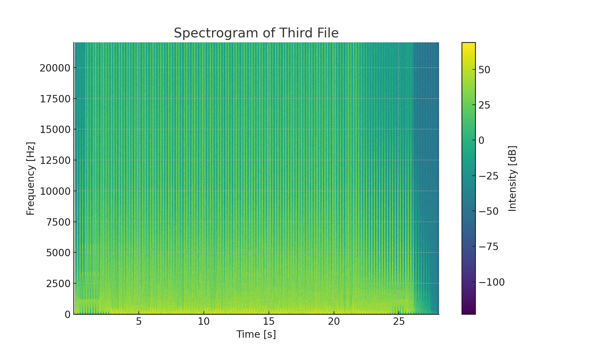
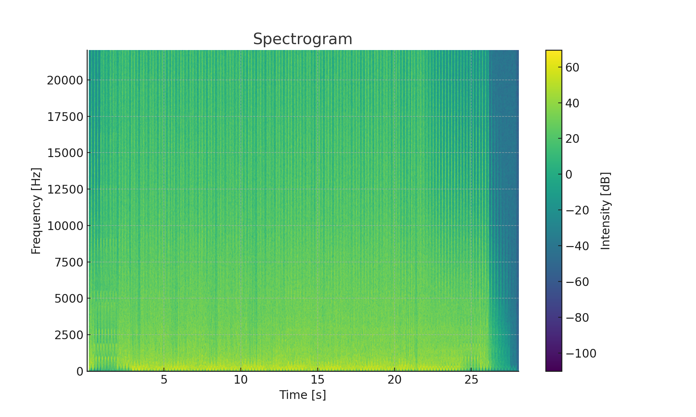
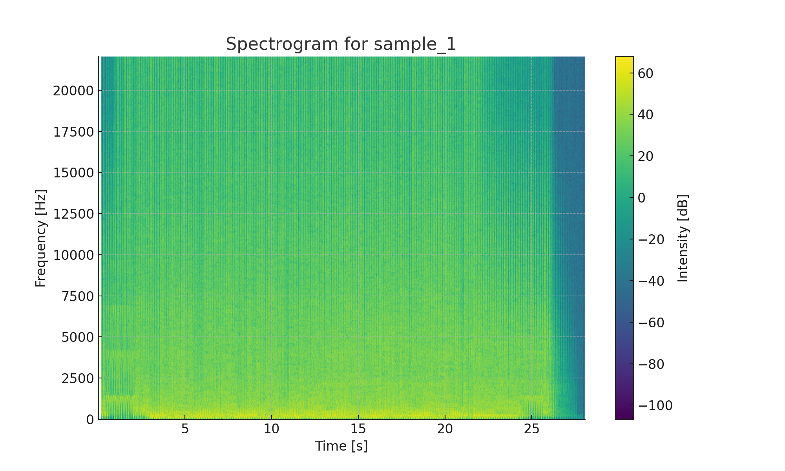
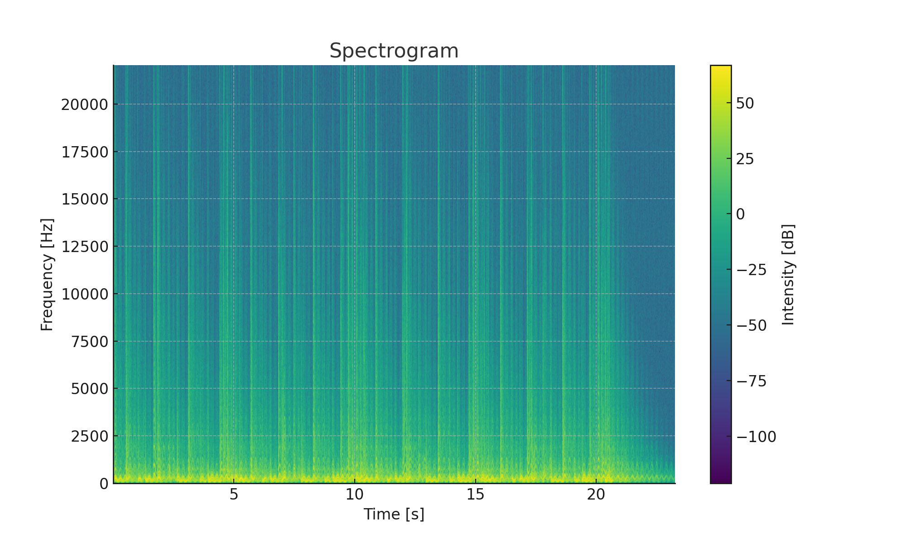
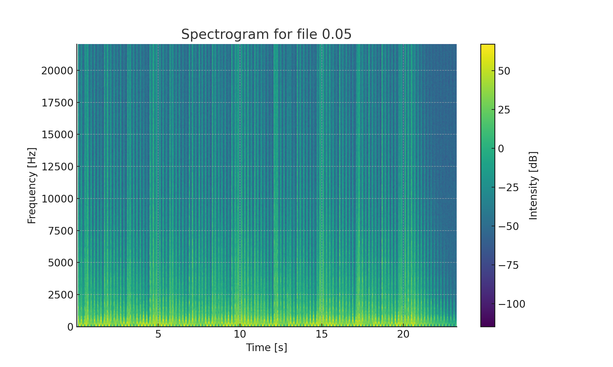
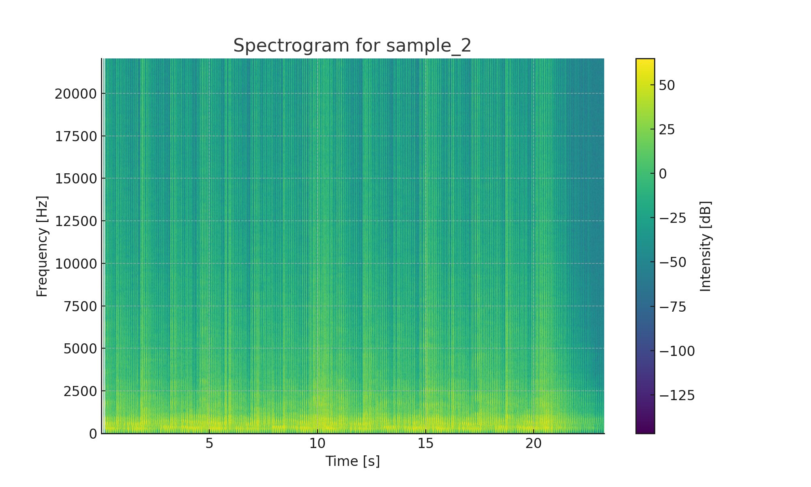

# Spectrogram Visualizations

## Sample 1 Spectrograms

- **Spectrogram for Sample 1 (0.01)**  
  

- **Spectrogram for Sample 1 (0.05)**  
  

- **Spectrogram for Sample 1 (0.1)**  
  

- **Spectrogram for Sample 1 using Rust (0.1)**  
  

## Sample 2 Spectrograms

- **Spectrogram for Sample 2 (0.01)**  
  

- **Spectrogram for Sample 2 (0.05)**  
  

- **Spectrogram for Sample 2 (0.1)**  
  

- **Spectrogram for Sample 2 using Rust (0.1)**  
  
